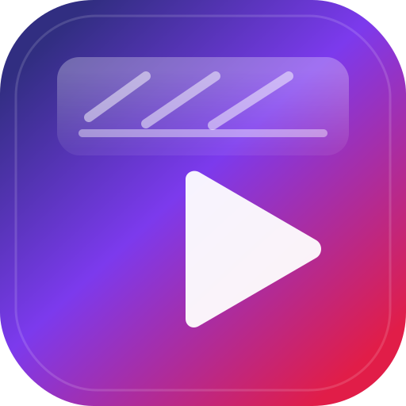

<div align="center">



# Reels Search

**Seçtiğin Instagram hesaplarından Reels topla, ara ve düzenli şekilde izle.**

[Uygulamayı çalıştır](#geliştir) · [Cloudflare’e dağıt](#dağıtım)

</div>

---

## Ne işe yarıyor?

Reels Search, Instagram Reels içeriklerini **kendi belirlediğin kaynak listesi** üzerinden görüntülemen ve **başlık, etiket ve filtrelerle arama** yapman için bir web uygulamasıdır. Akışı tek tek hesaplarda gezmek yerine; kategoriler, hesap grupları ve arama ile odaklanmış bir izleme deneyimi sunar.

## Neden var?

Instagram’ın kendi arayüzü çok hesap ve çok içerik için pratik olmayabiliyor. Bu proje; **belirli nişleri, içerik üreticilerini veya temaları** bir arada tutup, metin araması ve sıralama ile hızlıca bulmayı hedefler. Kendi sunucunda veya Cloudflare üzerinde çalıştırılabilir; veri ve kullanım tercihleri sana kalır.

## Nasıl çalışır? (kısaca)

- **Kaynaklar:** İzlemek istediğin hesapları eklersin; uygulama bu kaynaklardan gelen Reels verisini işler.
- **Keşif / arama:** Başlık ve etiketlere göre arama, sıralama ve sanal liste ile performanslı kaydırma.
- **Dağıtım:** [Next.js](https://nextjs.org) ve [OpenNext Cloudflare](https://opennext.js.org/cloudflare) ile edge’e yakın çalışan bir yapı; PWA desteği ile ana ekrana eklenebilir.

Teknik ayrıntılar ve ortam değişkenleri için repodaki `.dev.vars.example` dosyasına bak.

## Marka ve uygulama ikonu

Merkezde vektör tabanlı logo dosyaları kullanılıyor:

| Dosya | Amaç |
|--------|------|
| [`public/logo.svg`](public/logo.svg) | Ana logo (vektör, landing vb.) |
| [`public/favicon.svg`](public/favicon.svg) | Sekme ikonu (hafif, SVG) |
| [`public/logo.png`](public/logo.png) | 512×512 PNG (`any` PWA, yedek ikon) |
| [`public/logo-maskable.png`](public/logo-maskable.png) | Android maskable güvenli alan |
| [`public/apple-touch-icon.png`](public/apple-touch-icon.png) | Apple “Ana Ekrana Ekle” |

Logoyu değiştirdikten sonra PNG’leri yeniden üretmek için (macOS + Homebrew [librsvg](https://wiki.gnome.org/Projects/LibRsvg)):

```bash
rsvg-convert -w 512 -h 512 public/logo.svg -o public/logo.png
rsvg-convert -w 512 -h 512 public/logo-maskable.svg -o public/logo-maskable.png
rsvg-convert -w 180 -h 180 public/logo.svg -o public/apple-touch-icon.png
```

## Geliştir

Yerelde Next.js geliştirme sunucusu:

```bash
npm run dev
```

Tarayıcıda [http://localhost:3000](http://localhost:3000) adresini aç.

## Önizleme (Cloudflare çalışma zamanı)

```bash
npm run preview
```

## Dağıtım

Cloudflare’e dağıtım:

```bash
npm run deploy
```

Ek bilgi: [OpenNext Cloudflare dokümantasyonu](https://opennext.js.org/cloudflare).

## Lisans ve katkı

Bu depo [Next.js](https://nextjs.org/docs) ekosistemini kullanır. Geri bildirim ve katkılar için GitHub üzerinden issue veya PR açabilirsin.
